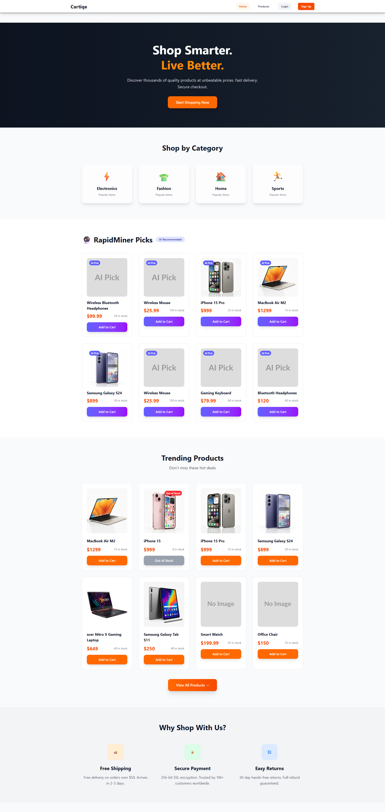
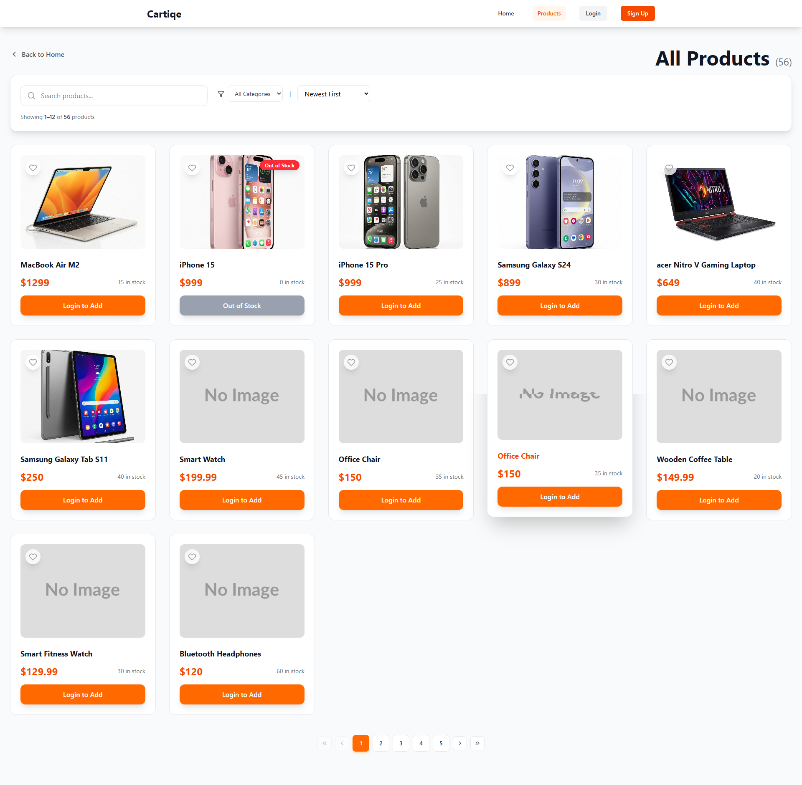

# 🛒 MERN-Stack-E-Commerce-Platform

A full-stack **E-commerce platform** built with **React, Node.js, Express, and MongoDB**.
Users can browse products, add items to cart, and place orders. Admins can manage products and orders through a dashboard.

---

# 🚀 Features

## 👤 User Features

* Browse products
* View product details
* Add products to cart
* Manage cart items
* User authentication (Login/Register)
* Place orders

## 🛠 Admin Features

* Admin dashboard
* Add new products
* Edit products
* Delete products
* Manage orders
* View users

---

# 🧰 Tech Stack

### Frontend

* React
* React Router
* Tailwind CSS
* Axios

### Backend

* Node.js
* Express.js
* MongoDB
* JWT Authentication
* Mongoose

---

# 📁 Project Structure

```
ecommerce-project
│
├── ecommerce-backend
│   ├── src
│   ├── .env
│   ├── .env.example
│   ├── package.json
│   ├── package-lock.json
│   ├── rapidminer_input.csv
│   └── .gitignore
│
├── ecommerce-frontend
│   ├── src
│   ├── dist
│   ├── .env
│   ├── index.html
│   ├── package.json
│   ├── package-lock.json
│   ├── tailwind.config.js
│   ├── vite.config.js
│   ├── eslint.config.js
│   └── lint.json
│
├── screenshots
│   ├── home.png
│   ├── products.png
│   └── admin_dashboard.png
│
├── README.md
└── .gitignore

```

---

# ⚙️ Installation

## 1️⃣ Clone the repository

```
git clone https://github.com/shikeshjayan/mern-ecommerce-app.git

```

---

## 2️⃣ Backend Setup

```
cd backend
npm install
```

Create `.env`

```
PORT=5000
MONGO_URI=your_mongodb_connection
JWT_SECRET=your_secret_key
```

Run backend server

```
npm run dev
```

---

## 3️⃣ Frontend Setup

```
cd frontend
npm install
npm run dev
```

Frontend will run on:

```
http://localhost:5173
```

---

# 🔗 API Endpoints

## Products

```
GET /api/products
GET /api/products/:id
POST /api/products
PUT /api/products/:id
DELETE /api/products/:id
```

## Auth

```
POST /api/auth/register
POST /api/auth/login
```

---

# 📸 Screenshots

### Home Page



Product listings and categories.

### Product Page



Detailed product information.

### Admin Dashboard


Manage products and orders.

---

# 🔐 Authentication

* JWT-based authentication
* Protected routes for users
* Admin-only routes for dashboard

---

# 📦 Future Improvements

* Payment integration (Stripe)
* Order history
* Product reviews
* Wishlist
* Advanced filtering

---

# 👨‍💻 Author

Developed by **[Shikesh Jayan]**

---

# 📄 License

This project is licensed under the **MIT License**.
